# Social-Network-API

## Badge
[]
 

## Table of Contents
- [Description](#description)
- [Screenshots](#screenshots)
- [Usage](#usage)
- [What I Have Learned](#what-i-have-learned)
- [Credits](#credits)
- [Licenses](#licenses)
 

## Description
Challenge 18 coursework for UT bootcamp. Uses Express.js, Mongoose, MongoDB, and JS date formats.  
This challenge required building a back-end for a social network API, with connecting to   
MongoDB to store and retrieve data. Routes were tested with ThunderClient, built-in to VSCode.  

## Screenshots
---MongoDB User---  
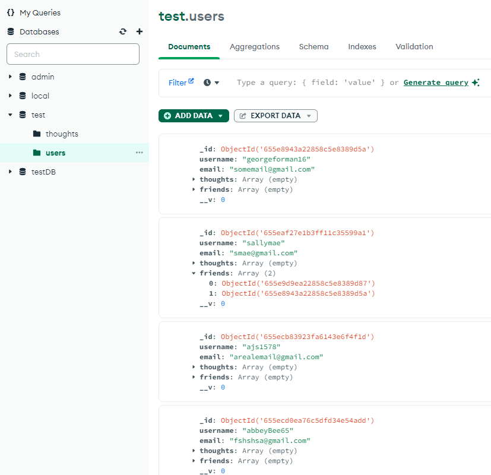
 

---MongoDB Test---  
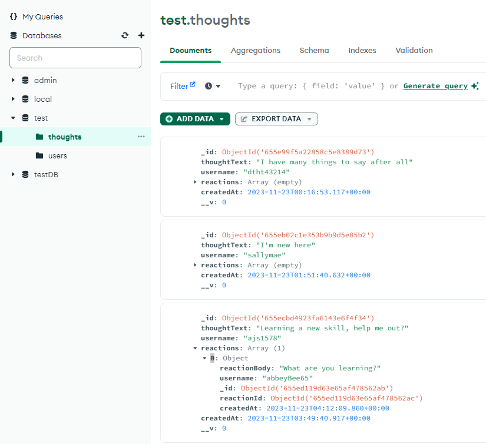
 

---Launching the program---  
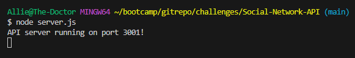
 

---Collections & Requests---  
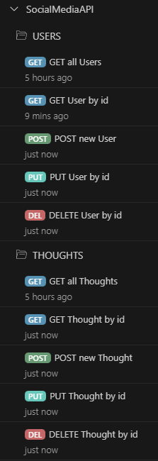
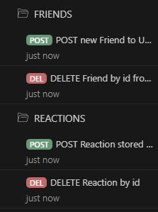
 

------USERS------  
---GET all users---  
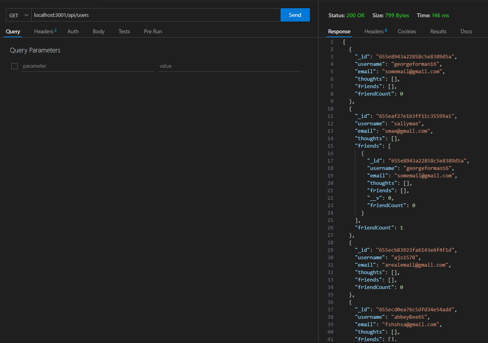
 

---GET single user---  
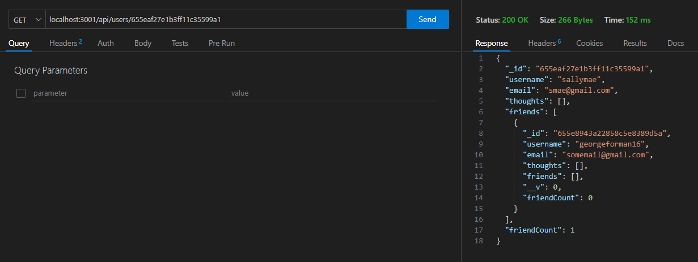
 

---POST new user---  
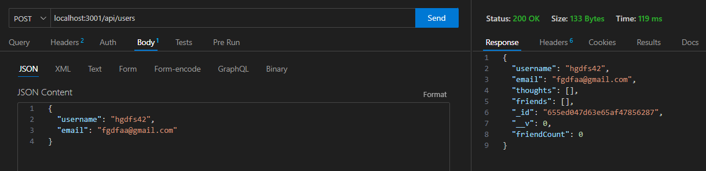
 

---PUT old user---  
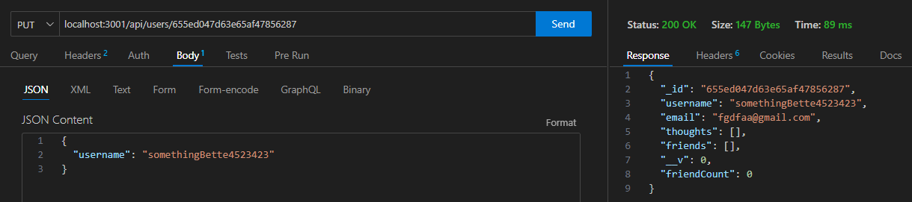
 

---DELETE user---  
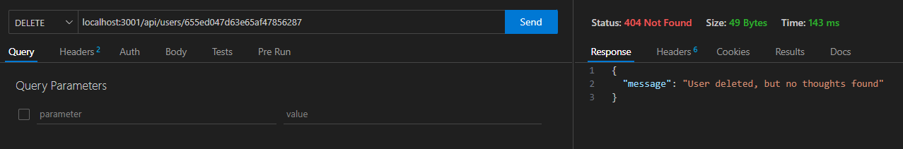
 

------THOUGHTS------  
---GET all thoughts---  
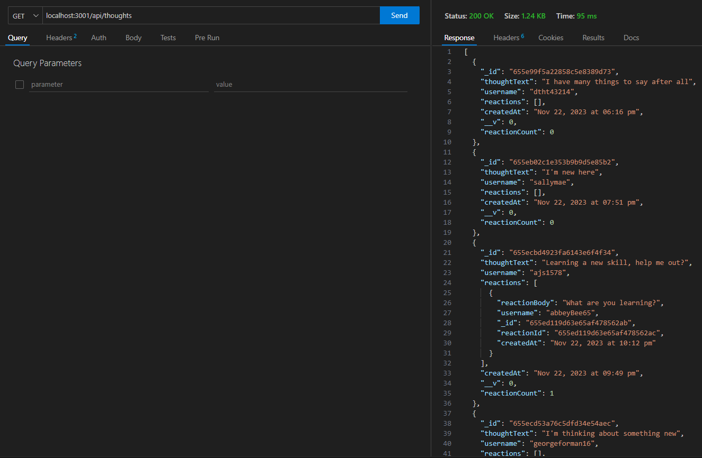
 

---GET single thought---  
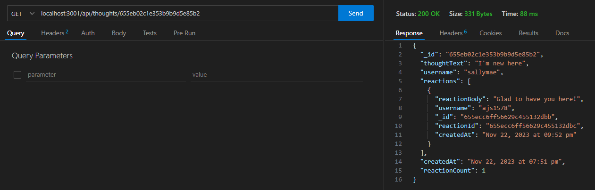
 

---POST new thought---  
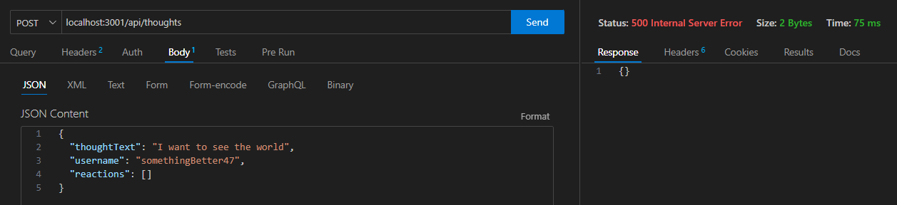
 

---PUT old thought---  
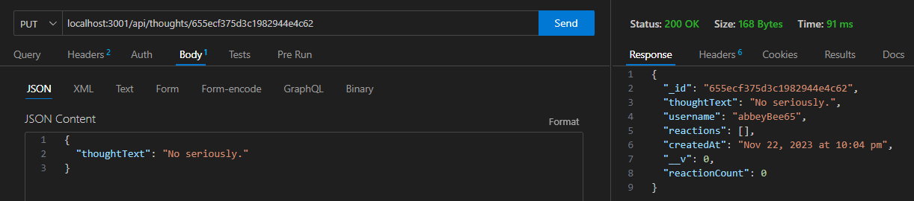
 

---DELETE thought---  
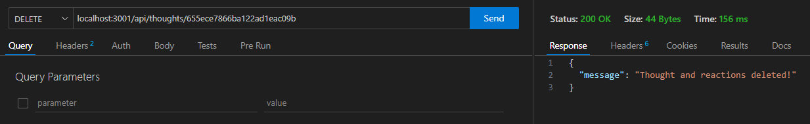
 

------FRIENDS------  
---POST new friend for user---  
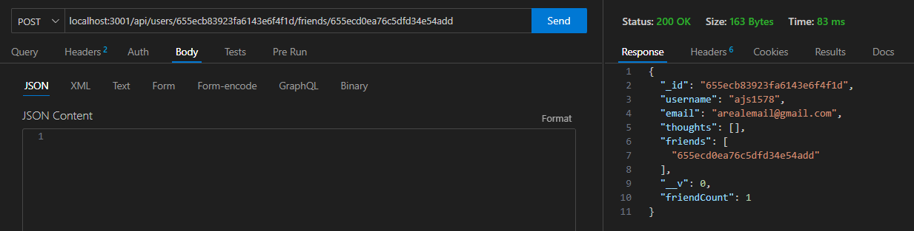
 

---DELETE friend from user---  
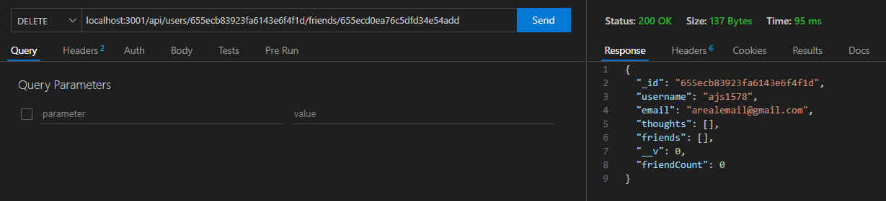
 

------REACTIONS------  
---POST new reaction for thought---  
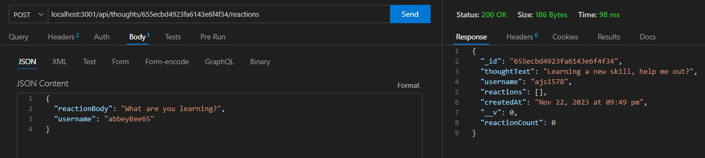
 

---DELETE reaction from thought---  
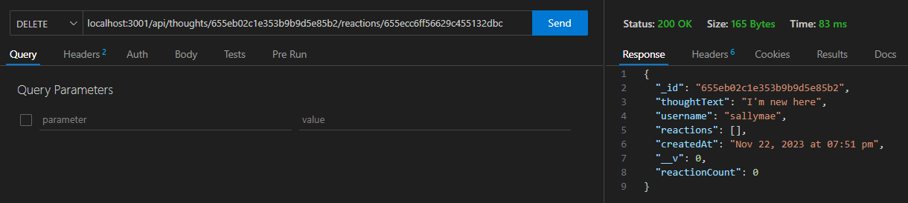
 

## Usage
Simply click on the link and watch the magic happen.    
Link to the video: https://drive.google.com/file/d/1VALWYUsYD-yb5gOWR1szgLjMJ04JMtmW/view?usp=sharing  

## What I Have Learned
I have a more solid foundation in route testing than I did before  
as well as getting used to how MondoDB connects and works with VSCode files.  
Using schemas as models, and controllers as the functions that routes call to,  
seems more efficient than MVC designs learned in the past.  

## Credits
Made by Allie Stewart.  
Some help from our module 18 coursework, as well as  
https://stackoverflow.com.  

## Licenses
Please refer to the LICENSE in the repository.  